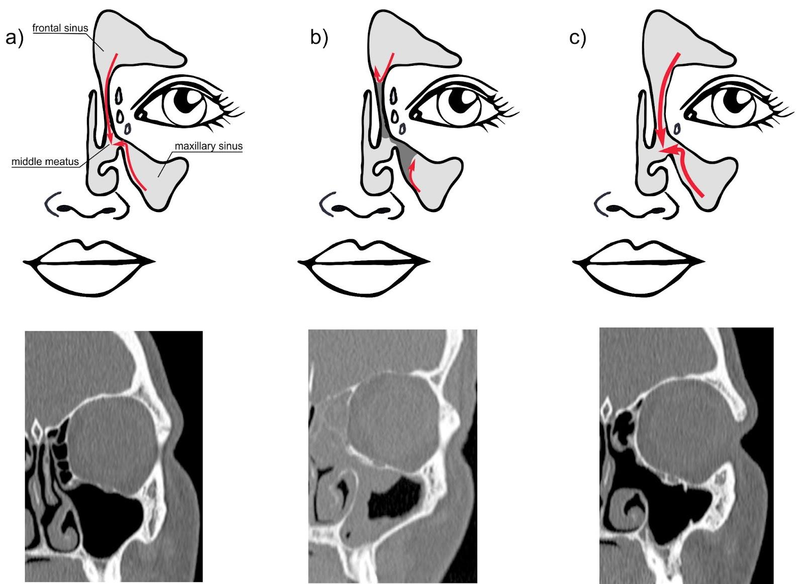

# Spatial variability of the microbiome in chronic rhinosinusitis is associated with the patients' clinical characteristics but not with sinus ostia occlusion
A repository that contains analysis code for the paper "Spatial variability of the microbiome in chronic rhinosinusitis is associated with the patients' clinical characteristics but not with sinus ostia occlusion" by Szaleniec et al. 2022.  
The analysis is split in two folders, `microbiome-analysis` and `picrust2-analysis`.   
In the first folder, the microbiome analysis using [QIIME2](https://qiime2.org/) is stored. In folder `microbiome-analysis/artifacts` you may find a custom feature classifier produced with the use of [RESCRIPt](https://www.ncbi.nlm.nih.gov/pmc/articles/PMC8601625/). 
In the second folder, we performed functional prediction using [PICRUSt2](https://www.nature.com/articles/s41587-020-0548-6) & analyzed the predictions obtained from the pipeline. 

